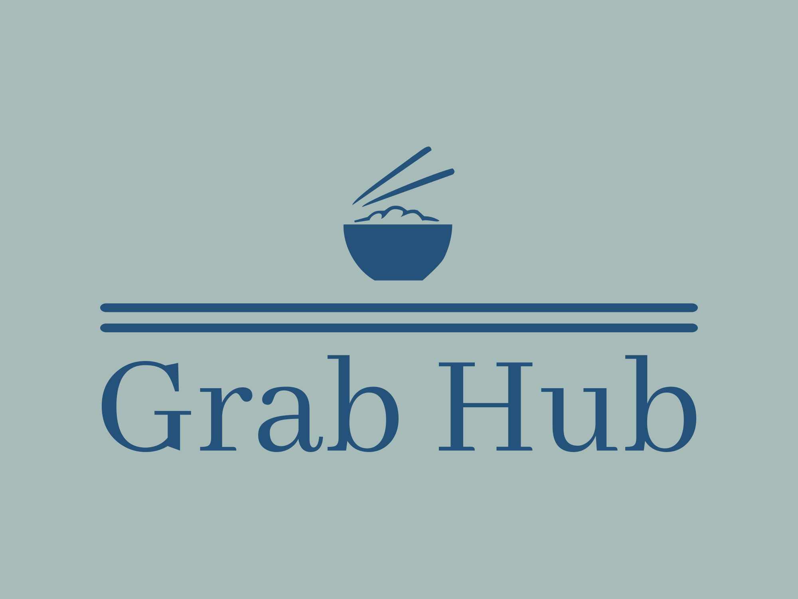
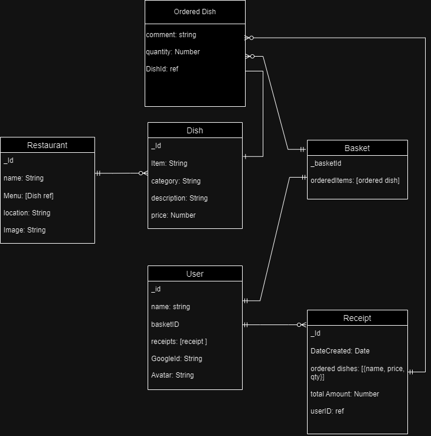
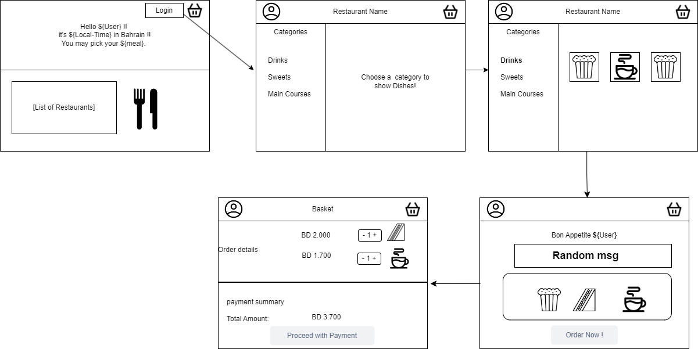

# GrabHub App

### Group Members:

Fatema Aljonaid | Abeer Majeed | Ghazi Muqbel | Sara Alalawi

### 

---

### **_About the project_**

#### Our Journey

After a long journey in terms of knowledge and not in time, we have gained the experience and knowledge necessary to develop the first full stack application where we used the learnt skills to develop it.

#### Our App

Step into our culinary adventure with our innovative Food Delivery app! Seamlessly explore a diverse range of dining options and order from multiple restaurants with ease, all from the convenience of your fingertips. With our app, you can fill your basket from a plenty of dining establishments, offering unparalleled choice and flexibility. Plus, enjoy timely reminders tailored to your location in the Kingdom of Bahrain, ensuring you never miss the perfect mealtime, whether it's breakfast, lunch, or dinner. Welcome to a world of culinary convenience at your doorstep.

### **_Design Phase_**

#### Managment of The Workflow
[Trello Board](https://trello.com/b/TRVA5v78/project)

#### Entity-Relationship Diagram (ERD):

#### Wireframes:

---

### **_Technologies_**

**_Backend Development:_**

- **_Node.js:_** Our chosen runtime environment for server-side JavaScript execution.
- **_Express.js:_** The minimalist web application framework we utilized for streamlined API development.
- **_MongoDB:_** Our flexible NoSQL database management system, ideal for storing and managing data.

**_Project Management and Collaboration:_**

- **_Trello:_** Our to-go tool for organizing tasks and managing project workflows.
- **_Slack:_** The communication platform that kept our team connected and facilitated collaboration.

**_Diagramming and Visualization:_**

- **_Drawio:_** The tool used to make the wireframe and ERD. 

---

### **_Get Started_**

1. Navigate to the app URL, you shall view a welcome page with restaurants list. P.S: You can view restaurants only when not logged in.
2. Upon login, you will be redirected to the restaurant of your choice, view and order from the categorized menu dishes.
3. Picked dish picture will be displayed on the right side of the page.
4. click on "Order Now" button to move your "Yummy" meal to the basket!
5. Review your order details and payment summary & "Proceed with Payment"

**_Features:_**

- [X] Local time shown in first page
- [X] List of restaurants
- [X] Each restaurant page contains menu and categories
- [X] Multi orders from different restaurants at same time
- [ ] optional comments before confirm order
- [X] App contains basket and payment page

---

### **_Future Updates_**

- [ ] Admin Dashboard
- [X] Branding (Logo, Colors, Fonts)
- [ ] APIs
- [ ] Additional Toppings
- [ ] the app will have order tracking map

---

### **_Credits_**
- [Express Documentation](https://expressjs.com/en/guide/using-middleware.html)
- [W3Schools](https://www.w3schools.com/)
- [Flaticon](https://www.flaticon.com/)
- [shecodes](https://palettes.shecodes.io/palettes/1475)
- [postimg](https://postimg.cc/)
- [ResizePixel](https://www.resizepixel.com/)
- [logo.com](https://logo.com/)
- [Express Documentation](https://expressjs.com/en/guide/using-middleware.html)
- [W3Schools](https://www.w3schools.com/)
- [Flaticon](https://www.flaticon.com/)
- [shecodes](https://palettes.shecodes.io/palettes/1475)
- [postimg](https://postimg.cc/)
- [ResizePixel](https://www.resizepixel.com/)
- [logo.com](https://logo.com/)

