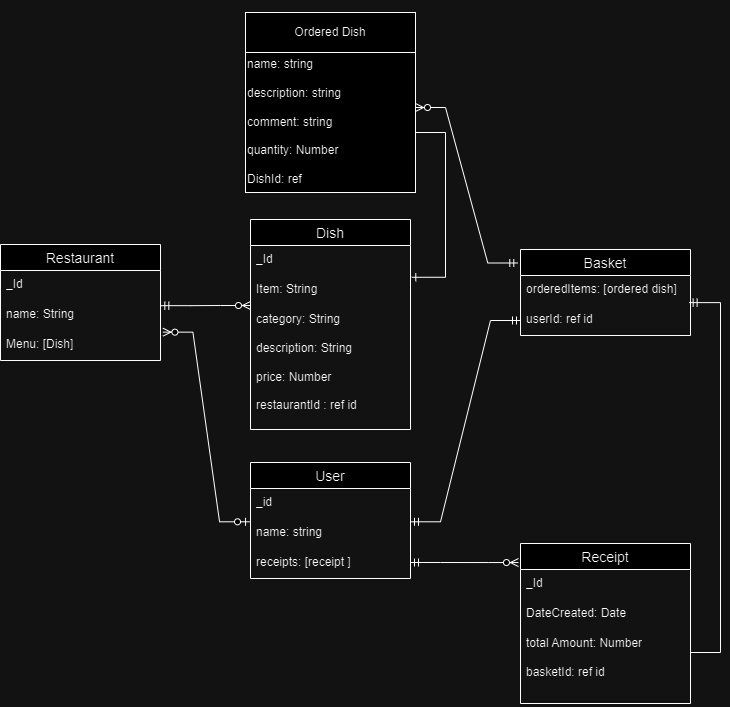

# restaurants app

## Date : 09/05/2024

### Group Members:

Fatema Aljonaid | Abeer Majeed | Ghazi Muqbel | Sara Alalawi

### 

---

### **_About the project_**

#### Our Journey

After a long journey in terms of knowledge and not in time, we have gained the experience and knowledge necessary to develop the first full stack application where we used the learnt skills to develop it.

#### Our App

Step into our culinary adventure with our innovative Food Delivery app! Seamlessly explore a diverse range of dining options and order from multiple restaurants with ease, all from the convenience of your fingertips. With our app, you can fill your basket from a plenty of dining establishments, offering unparalleled choice and flexibility. Plus, enjoy timely reminders tailored to your location in the Kingdom of Bahrain, ensuring you never miss the perfect mealtime, whether it's breakfast, lunch, or dinner. Welcome to a world of culinary convenience at your doorstep.

### **_Design Phase_**

#### Entity-Relationship Diagram (ERD):

#### Wireframes:

#### Managment of The Workflow

[See it Here](https://trello.com/b/TRVA5v78/project)

---

### **_Technologies_**

**_Backend Development:_**

- **_Node.js:_** Our chosen runtime environment for server-side JavaScript execution.
- **_Express.js:_** The minimalist web application framework we utilized for streamlined API development.
- **_MongoDB:_** Our flexible NoSQL database management system, ideal for storing and managing data.

**_Project Management and Collaboration:_**

- **_Trello:_** Our go-to tool for organizing tasks and managing project workflows.
- **_Slack:_** The communication platform that kept our team connected and facilitated collaboration.

**_Diagramming and Visualization:_**

The Wire Frame below will guide you on how you will be redirected through our app including from all the features included:

1. Navigate to the app URL, you shall view a welcome page with restaurants list. P.S: You can view restaurants only (Not order) when not logged in.
2. Upon login, you will be redirected to the restaurant of your choice, view and order select from the categorized menu dishes.
3. Picked dish picture will be displayed on the right side of the page.
4. click on "Order Now" button to move your "Yummy" meal to the basket!
5. Review your order details and payment summary & "Proceed with Payment"

- [ ] Local time shown in first page
- [ ] List of restaurants
- [ ] Each restaurant page contains menu and categories
- [ ] Multi orders from different restaurants at same time
- [ ] optional comments before confirm order
- [ ] App contains basket and payment page

---

### **_Future Updates_**

- [ ] Admin Dashboard
- [ ] Branding (Logo, Colors, Fonts)
- [ ] APIs
- [ ] Additional Toppings
- [ ] the app will have order tracking map

---

### **_Credits_**

### **Screenshots**

